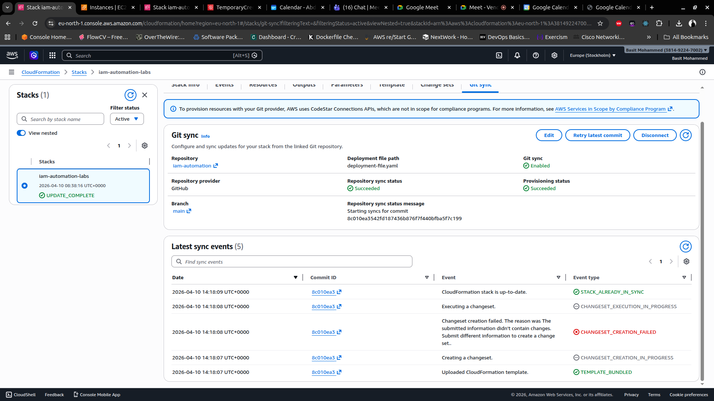
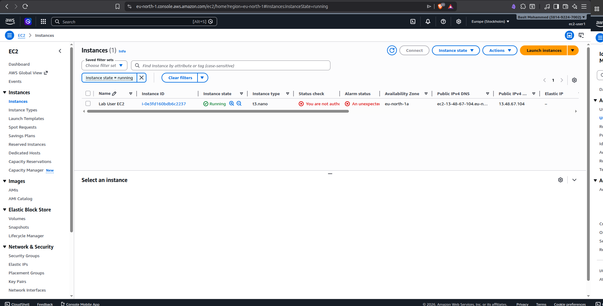
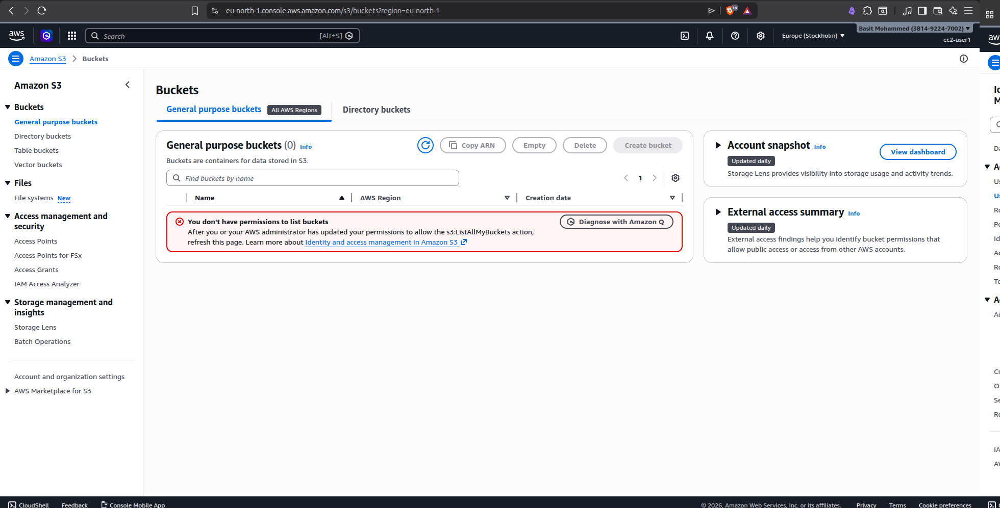
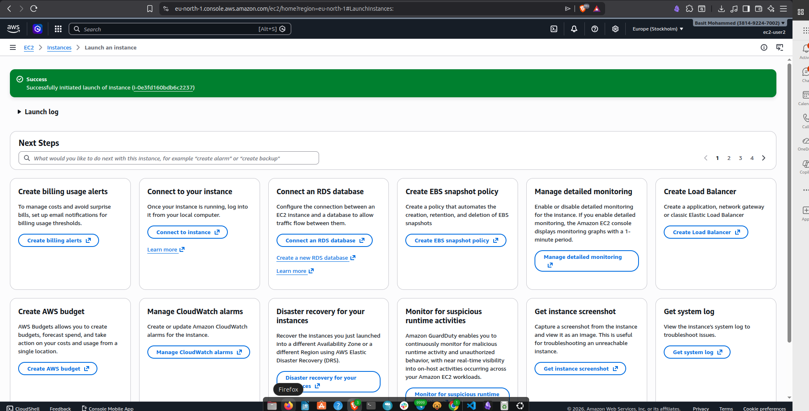
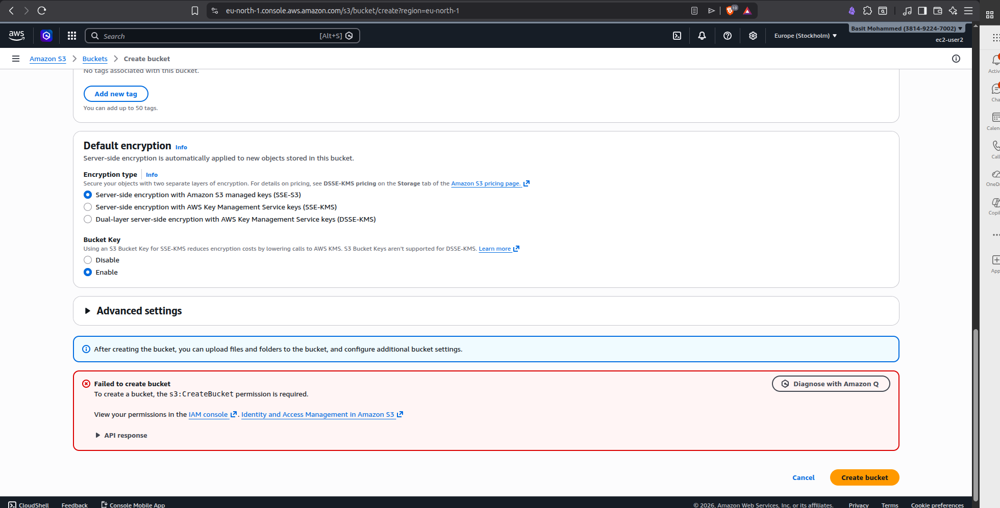
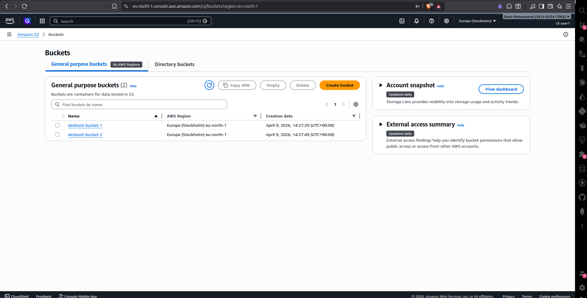
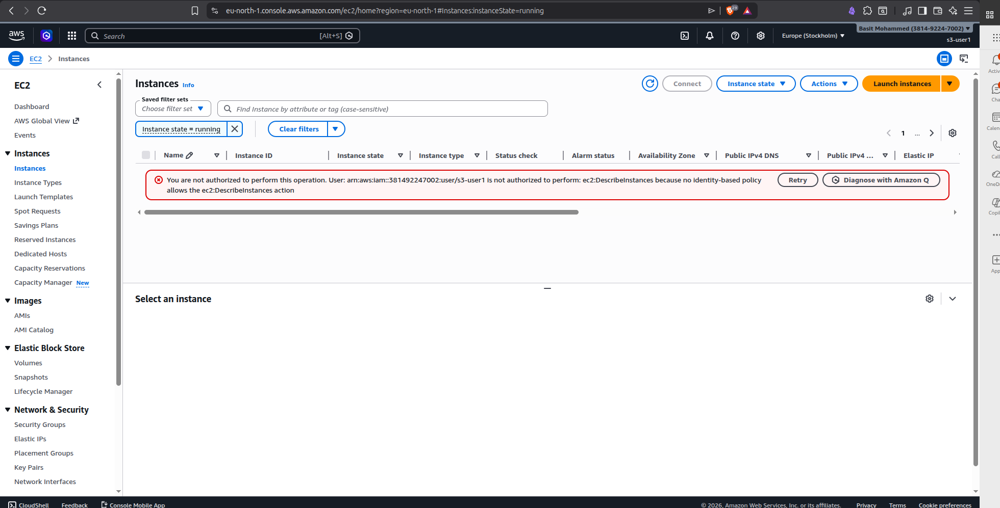

# IAM Automation Lab (AWS CloudFormation + GitSync)

## Overview
This project demonstrates automated creation and management of AWS IAM resources using CloudFormation integrated with GitSync. The stack provisions IAM users, groups, and policies with secure credential handling via AWS Secrets Manager.

## Architecture
- CloudFormation template defines all IAM resources
- GitSync links the GitHub repository to the CloudFormation stack
- Secrets Manager generates and stores a temporary shared password

## Resources Created
### IAM Users
- ec2-user1 (EC2 access)
- ec2-user2 (EC2 access)
- s3-user (S3 access)

### IAM Groups
- EC2UserGroup (EC2 permissions)
- S3UserGroup (S3 permissions)

### Policies
- EC2GroupAccess: Allows describing and launching EC2 instances
- S3ReadOnlyAccess: Allows listing S3 buckets
- IAMUserChangePassword: Allows users to change their own passwords
- EC2User2PermissionBoundary: Permission boundary applied to ec2-user2 that restricts EC2 instance creation

### Secrets Manager
- TemporaryCredentials: Stores auto-generated password used for all users

## Permissions Model
- ec2-user1 can:
  - View and launch EC2 instances
  - Cannot access S3

- ec2-user2 can:
  - View EC2 instances
  - Cannot launch EC2 instances (restricted by permission boundary)
  - Cannot access S3

- S3 user can:
  - List S3 buckets
  - Cannot access EC2

### Permission Boundary
`ec2-user2` has a permission boundary (`EC2User2PermissionBoundary`) attached directly to the user. Both users belong to the same `EC2UserGroup` with identical group policies, but the boundary caps ec2-user2's effective permissions by omitting `ec2:RunInstances`. Effective permissions are the intersection of the identity-based policy and the boundary — so even though the group grants `RunInstances`, ec2-user2 is blocked.

```
ec2-user2 effective permissions = EC2GroupPolicy ∩ EC2User2PermissionBoundary
```

## Deployment
The stack is deployed using GitSync.

### Deployment File
```
template-file-path: cloudformation/policy.yaml
stack-name: IAM-automation-lab
```

### Steps
1. Push changes to the repository
2. GitSync automatically updates the CloudFormation stack

### GitSync Evidence
GitSync enabled and syncing from GitHub:


## Testing
Each user is tested via AWS Console login.

Expected results:

| User | EC2 View | EC2 Launch | S3 Access |
|------|----------|------------|-----------|
| ec2-user1 | Success | Success | Access Denied |
| ec2-user2 | Success | Access Denied (boundary) | Access Denied |
| s3-user | Access Denied | Access Denied | Success |

Screenshots should be captured for each access attempt.

### Screenshots
EC2 users:
- Success (EC2 instance view): 
- Access denied (S3): 
- Success (EC2 instance creation): 
- Access denied (S3): 

S3 user:
- Success (S3 bucket view): 
- Access denied (EC2): 

## Security Considerations
- Passwords are generated securely using AWS Secrets Manager
- Users are required to change password at first login
- Least privilege access is enforced via IAM groups
- Permission boundaries are used to restrict individual users within a group without modifying shared group policies

## Repository Structure
```
iam-automation/
├── deployment-file.yaml
└── cloudformation/
    └── policy.yaml
```

## Conclusion
This project demonstrates infrastructure as code principles applied to IAM resource management, along with automated deployment using GitSync and secure credential handling.